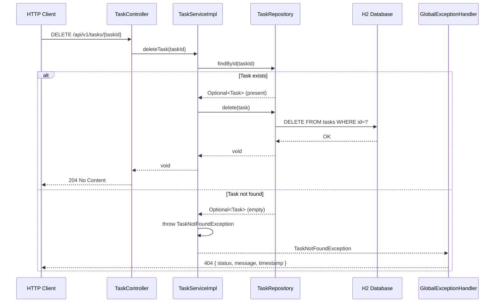

# Architecture Decision — EPMICMPCOD-304: Delete a Task

**Generated:** 2026-04-29T00:06:00Z  
**Ticket:** EPMICMPCOD-304 — Delete a Task  
**Branch:** EXE-304/delete-a-task  
**Approved:** 2026-04-29T00:06:00Z  
**Version:** v1

---

## 1. System Overview

This ticket adds a **hard-delete** capability to the Task Management REST API.
The existing service (established in EPMICMPCOD-299) already includes a
`deleteTask(Long taskId)` method on the service layer and a corresponding
`DELETE /api/v1/tasks/{taskId}` endpoint on the controller. Because the
`developer` branch was cleaned after that work, the full project scaffold must
be re-established as part of this delivery, with the DELETE endpoint as the
primary functional requirement.

**Core Objectives:**
- Expose a standards-compliant REST DELETE endpoint
- Return `204 No Content` on successful deletion
- Return a structured `404 Not Found` response when the task does not exist
- Maintain the layered architecture (Controller → Service → Repository → DB)
- Keep the implementation stateless and transactional

---

## 2. High-Level Architecture

```mermaid
flowchart LR
    Client["HTTP Client"] -->|DELETE /api/v1/tasks/{id}| Controller["TaskController"]
    Controller --> Service["TaskServiceImpl"]
    Service --> Repo["TaskRepository\n(JpaRepository)"]
    Repo --> DB["H2 In-Memory DB\n(tasks table)"]
    Service -->|TaskNotFoundException| EH["GlobalExceptionHandler\n(@RestControllerAdvice)"]
    EH -->|404 ErrorResponse JSON| Client
```

### Component Map

| Layer | Class | Responsibility |
|---|---|---|
| Entrypoint | `TaskApplication` | `@SpringBootApplication` bootstrap |
| REST | `TaskController` | Route `DELETE /api/v1/tasks/{taskId}` → 204 |
| Service Interface | `TaskService` | Contract: `void deleteTask(Long)` |
| Service Impl | `TaskServiceImpl` | Find task → delete → propagate exception |
| Repository | `TaskRepository` | `JpaRepository<Task, Long>` |
| Entity | `Task` | JPA entity mapping to `tasks` table |
| Enums | `TaskStatus`, `TaskPriority` | Status/priority value types |
| Exception | `TaskNotFoundException` | Thrown when task ID not found |
| Error Handling | `GlobalExceptionHandler` | Maps `TaskNotFoundException` → 404 |
| Error DTO | `ErrorResponse` | Structured error payload |
| Config | `application.properties` | H2 datasource, JPA DDL, port |
| Build | `pom.xml` | Spring Boot 3.4.5, Java 21, JaCoCo |

---

## 3. REST API Specification

### DELETE /api/v1/tasks/{taskId}

| Field | Value |
|---|---|
| Method | `DELETE` |
| Path | `/api/v1/tasks/{taskId}` |
| Path Parameter | `taskId` (Long, required) — ID of the task to delete |
| Request Body | None |
| Success Response | `204 No Content` (empty body) |
| Not Found Response | `404 Not Found` (JSON body — see below) |

**404 Response Body:**
```json
{
  "status": 404,
  "message": "Task not found with id: 42",
  "timestamp": "2026-04-29T00:06:00"
}
```

---

## 4. Detailed Request Flow



---

## 5. Component Design

### 5.1 TaskController
- Annotation: `@RestController`, `@RequestMapping("/api/v1/tasks")`
- Method: `@DeleteMapping("/{taskId}")` → `ResponseEntity<Void>`
- Returns `ResponseEntity.noContent().build()` on success (204)
- Delegates entirely to `TaskService.deleteTask(taskId)`

### 5.2 TaskServiceImpl
- Annotation: `@Service`, `@Transactional`
- `deleteTask(Long taskId)`:
  1. Call `taskRepository.findById(taskId)`
  2. Throw `TaskNotFoundException("Task not found with id: " + taskId)` if empty
  3. Call `taskRepository.delete(task)`
- No business rule changes; hard delete only

### 5.3 TaskRepository
- Extends `JpaRepository<Task, Long>`
- No new query methods required for deletion (uses inherited `findById` + `delete`)

### 5.4 Task Entity
- JPA entity mapped to `tasks` table
- Fields: `id`, `title`, `description`, `status` (enum), `priority` (enum), `createdAt`, `updatedAt`, `completedAt`
- Lifecycle callbacks: `@PrePersist`, `@PreUpdate`

### 5.5 GlobalExceptionHandler
- Annotation: `@RestControllerAdvice`
- Handles `TaskNotFoundException` → returns `ResponseEntity<ErrorResponse>` with status 404
- Handles generic `Exception` → 500 fallback

### 5.6 ErrorResponse
- Fields: `int status`, `String message`, `LocalDateTime timestamp`
- Serialised as JSON via Jackson

---

## 6. Data Management

| Aspect | Decision |
|---|---|
| Database | H2 in-memory (consistent with EPMICMPCOD-299 conventions) |
| ORM | Spring Data JPA (Hibernate) |
| DDL strategy | `spring.jpa.hibernate.ddl-auto=create-drop` (dev/test) |
| Schema changes | **None** — existing `tasks` table structure is sufficient |
| Soft-delete | **Not in scope** — hard delete per ticket requirement |
| Caching | Not required for this story |

---

## 7. Security Design

| Concern | Decision |
|---|---|
| Authentication | Out of scope for this ticket — no Spring Security configured |
| Input validation | `taskId` is a `Long` path variable; Spring MVC rejects non-numeric values with 400 automatically |
| SQL injection | Mitigated by JPA parameterised queries |
| Exception leakage | `GlobalExceptionHandler` returns only safe, structured messages; stack traces are never exposed |

---

## 8. Scalability & Deployment

| Aspect | Decision |
|---|---|
| Statefulness | Service is stateless — all state in DB |
| Deployment | Spring Boot fat-jar, containerisable via Docker |
| Concurrency | `@Transactional` on service methods; JPA handles row-level locks |
| Environment | H2 in-memory for dev/test; swap datasource config for prod Postgres/MySQL |

---

## 9. Package Structure

```
com.example.task
├── TaskApplication.java
├── config/                       (not needed for this story)
├── controller/
│   └── TaskController.java
├── dto/
│   ├── CreateTaskRequest.java
│   └── UpdateTaskRequest.java
├── entity/
│   ├── Task.java
│   ├── TaskPriority.java
│   └── TaskStatus.java
├── exception/
│   ├── ErrorResponse.java
│   ├── GlobalExceptionHandler.java
│   ├── InvalidTaskException.java
│   └── TaskNotFoundException.java
├── repository/
│   └── TaskRepository.java
└── service/
    ├── TaskService.java
    └── TaskServiceImpl.java
```

---

## 10. Build & Dependencies (pom.xml)

| Dependency | Version / Scope |
|---|---|
| `spring-boot-starter-parent` | 3.4.5 |
| `spring-boot-starter-web` | managed |
| `spring-boot-starter-data-jpa` | managed |
| `spring-boot-starter-validation` | managed |
| `h2` | runtime |
| `spring-boot-starter-test` | test |
| `jacoco-maven-plugin` | 0.8.8 |
| Java | 21 |

---

## 11. Acceptance Criteria Mapping

| Acceptance Criterion | Implemented By |
|---|---|
| User can delete a task by its ID | `DELETE /api/v1/tasks/{taskId}` → 204 |
| Non-existent task returns appropriate error | `TaskNotFoundException` → 404 JSON via `GlobalExceptionHandler` |
| Successfully deleted tasks are removed from persistence | `taskRepository.delete(task)` inside `@Transactional` method |
| Meaningful response for non-existent IDs | `ErrorResponse` with `status=404`, `message`, `timestamp` |

---

## 12. What Must Be Done ✅

- Re-scaffold full Spring Boot project (pom.xml + all layers)
- Implement `DELETE /api/v1/tasks/{taskId}` returning 204
- Implement `TaskNotFoundException` propagation → 404 structured response
- Ensure `@Transactional` wraps `deleteTask` in `TaskServiceImpl`
- Write unit tests for `TaskServiceImpl.deleteTask` (happy path + not-found path)
- Write integration/controller tests for the DELETE endpoint

## 13. What Must NOT Be Done 🚫

- No soft-delete (no `deletedAt` column, no `isDeleted` flag)
- No Spring Security / authentication
- No changes to the existing `Task` entity schema
- No new database migrations (H2 DDL auto handles schema)
- No changes to other endpoints (create, list, get, update)
